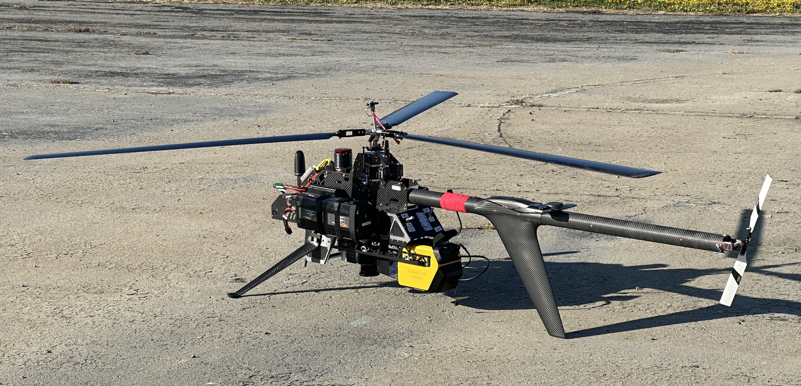

## Purpose

I would like to request a drone flight at the Monarch Butterfly Grove for sometime in September, before the overwintering period begins. Below is some information to help inform any questions that may come up.

## Drone

We will be flying an [AeroVironment Vapor 55 electric helicopter](https://www.avinc.com/images/uploads/product_docs/VAPOR55_datasheet_08302019.pdf). Mounted to the aircraft will be a LiDAR unit, multi-spectral sensor, and color camera. The total weight of the aircraft will not exceed 55 lbs, and will follow a preplanned mission.

## Flight

The flight will occur entirely within the grove, and the aircraft will not cross Highway 1 or enter the North Beach Campground. All crew will be positioned outside the flight area and will be able to communicate via radio. Spotters will be placed at the three entrances of the grove to help control pedestrian traffic. The pilot in command will be positioned at the southeast corner of the grove by the gate for the best line of sight.

The mission is expected to take less than 20 minutes to complete. Once finished, initial data quality will be verified to ensure another flight is not needed. If so, the same mission will be conducted again after troubleshooting.

In order to minimize foot traffic, the flight will occur early on a weekday, or when State Parks thinks is best.

It is imperative that people are not walking underneath the drone while it is in the air.

{fig-align="center"}